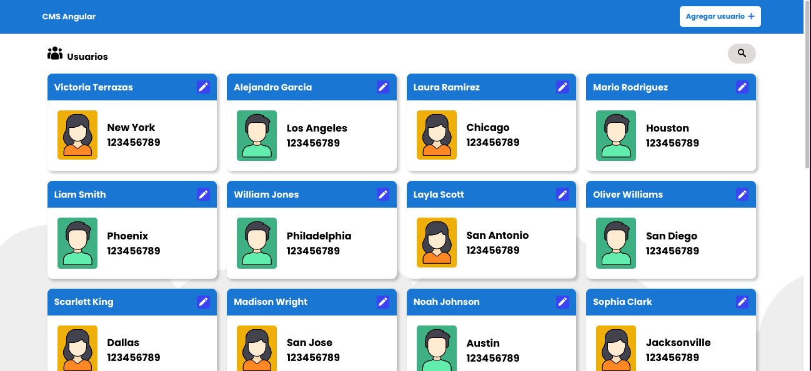

# CMS Angular

This project is about creating a SPA using Angular front-end framework and creating a service to connect with an API, in this case using json-server.



## :package: Built With

- HTML
- CSS
- Javascript
- Angular
- JSON-Server
- npm

## :computer: Getting Started

To get a local copy up and running follow these simple steps.

### Download

1) Clone the repository to your local machine

```sh
  $ git clone https://github.com/mcervantes71/CMS_Angular.git
```

2) cd into the directory

```sh
  $ cd CMS_Angular
```

### Requirements

[Node.js](https://nodejs.org) is required to install dependencies and run scripts via `npm`.

### Usage

This project was generated with [Angular CLI](https://github.com/angular/angular-cli) version 12.1.3.

## Development server

Run `ng serve` for a dev server. Navigate to `http://localhost:4200/`. The app will automatically reload if you change any of the source files.

## Build

Run `ng build` to build the project. The build artifacts will be stored in the `dist/` directory.

## :busts_in_silhouette: Authors

👤 **Martin Cervantes**

- Linkedin: [Martin Cervantes](https://www.linkedin.com/in/cervantesmartin/)
- Twitter: [@M4rt1nC3rv4nt3s](https://twitter.com/M4rt1nC3rv4nt3s)
- Github: [@mcervantes71](https://github.com/mcervantes71)
- Gmail: [cervantes.martine](mailto:cervantes.martine@gmail.com)

## 🤝 Contributing

    Contributions, issues and feature requests are welcome!

Feel free to check the [issues page](../../issues).

## :star2: Show your support

    Give a ⭐️ if you like this project!

## 📝 License

This project is [MIT](lic.url) licensed.
